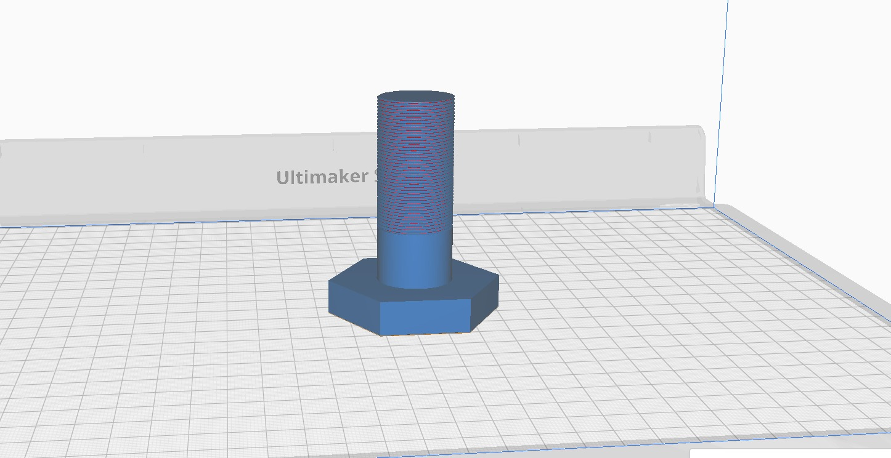

# Ex. No.   - PROTOTYPE PART MODEL DESIGN IN 3D PRINTER

### DATE:1.12.2025
## AIM: 
### To prototype the given part model design in 3D Printer.

## REQUIREMENTS:
### ●	3D Printer machine.
### ●	CURA 4.0 Software.
### ●	Autodesk Fusion 360 Software.
### ●	System - Windows 7 or higher, 1 GB RAM.

## PROCEDURE:

### Step 1:- Check all Electrical connections.

### Step 2:- First we install the software related the 3D printer (idea maker, ultimaker etc.)In idea maker first open the software and click the open file option as shown in below figure.

### Step 3:- select the Pan option and select the extruder (left of right) for printing the design and then after select the Repair option for auto correction of design of software parameter as shown in below figure.

### Step 4.:- select the Move option for design print position in build tack plate and then after select the Rotate option for rotate the design easily printed and used low print material as shown in below figure.

### Step 5.:- select the Scale option for design scale according to build plate area and then after click the start option and select printing option standard as shown in below figure.

### Step 6.:- After completing all settings then click the Slice option and export the file in gcode format.

### Step 7.:- After generating the gcode format then follow the these instruction as shown in below figure.
###   1.	Switch on the 3d printer.
###   2.	Place your Pen drive in USB.
###   3.	Clean the surface bed plate.
###   4.	Load filament into the required extruder as per the requirement.
###   5.	Wait until the nozzle & bed plate comes into the required temperature.
###   6.	Close the doors of the 3d printer.
###   7.	Open the file from the USB storage and select the Print option.

## Output:

### Name:Yuvasri V
### Register Number:25008890

## RESULT:
###   Thus a prototype of the given part model is developed using 3D Printer.
